# OpenStack

## Solutions Cloud utilisant OpenStack, Ansible, Terraform

### Partie I

- Pour donner les droits au fichier avant de commencer

```cmd
sudo chown test: clouds.yaml
```
1 - Création / Ajout d'une clef ssh dans votre projet


_**Pour créer une clé je suis allé dans “Paire de clés” et j’ai choisi un type de clé ssh.**_


**2 - Création Instance, type m1.medium, Image au choix mais sur un volume, security group SSH et Default
Ajout d'une Floating IP (réseau public2) et on se logge en SSH**


**Groupes de sécurité:**


**Floating IP:**


_**Test de connexion via SSH sur l'adresse public de l'instance crée:**_


Sur ma machine physique j’ai reussi a me connecter grâce à une clé publique que j’ai généré avec la commande _**ssh-keygen**_. Après la génération de clé publique j’ai importé le fichier lors de la création de mon instance. Ensuite j’ai attaché mon instance à une adresse publique et j’ai réussi à me connecter en ssh.

### Partie II - En utilisant CLI

#### 1. IMPORTANT -> en WebUI créé un "credential applicatif" avec les droits "member" puis télécharger le fichier clouds.yaml. Mettre ce fichier dans le dossier ~/.config/openstack/


2. Installer la CLI OpenStack sur votre machine

https://docs.openstack.org/newton/user-guide/common/cli-install-openstack-command-line-clients.html


3. Exo1 en CLI
- Génération d’une clé:


**Création d’une instance:**
```cmd
openstack server create --flavor m1.medium --image CentOS-Stream-9-20220914 --key-name
nouvelle_cle --security-group ssh --security-group default instance_2
```


**Verification:**


**Ajout d'une Floating IP (réseau public2) :**

```cmd
openstack floating ip create public2
```


Commande pour ajouter ip: 

```cmd
openstack server add floating ip instance_2 194.199.113.229
```
Check si @ip était prise:


Test de connexion à la machine en ssh:
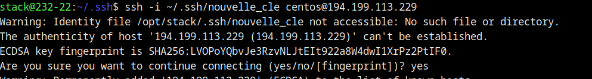

### Partie III - Wordpress avec une VM Web et une VM SQL à l'aide de HEAT
[Lien vers le script de deployment](scripts/deployment.yaml)

**SERVEUR WEB**
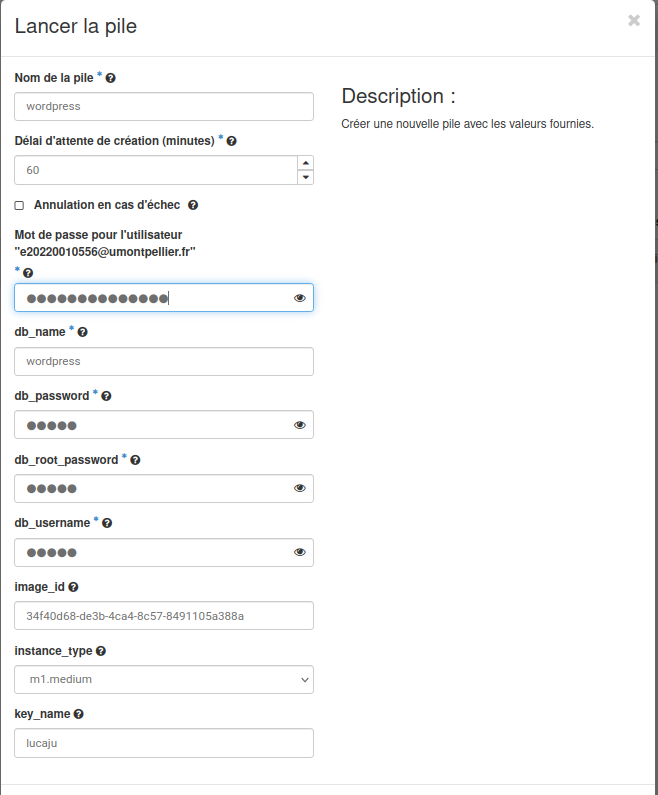

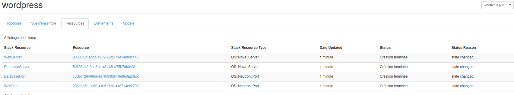

**Evenments:**
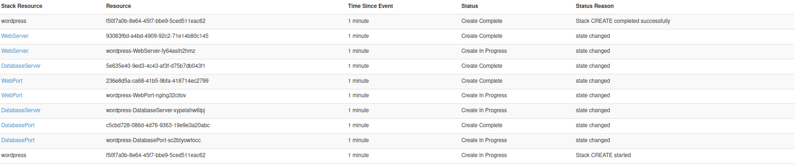

### Partie IV - Projet et Utilisateur sur le cloud IUT. Puis créé un réseau, sous réseau routeur connecté au réseau externe "public", créé sa clef ssh puis booter une machine.

**Utilisateur:**
```
User: lucaju13
MDP: Luc@as20001306
```
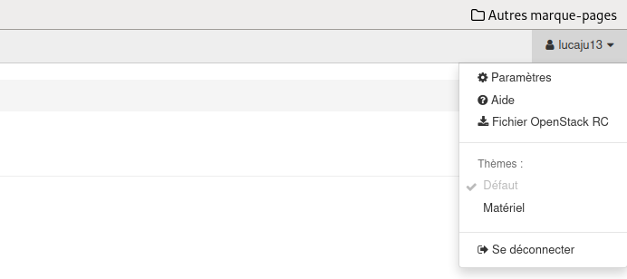

- J’ai créé un réseau qui s’apelle mon_reseau et ensuite dans ce réseau j’ai donné une adresse en sous-réseau en 192.168.1.0/24. Ensuite j’ai créé un routeur.

**Clé ssh:**


**Association d’Ip flottant:**


Après beaucoup de changements sur mon réseau j’ai réussi a faire un ssh, sur ma machine… Le
problème c’est que mon instance ne prenait pas d’IP et du coup j’ai créé un nouveau routeur et
un nouveau réseau avec des adresses privées différentes, je n’ai pas donné un adresse flotante de
suite, d’abord j’ai attendu que mon instance prenne un adresse IP ensuite j’ai rajouté le routeur et
un adresse flotante.

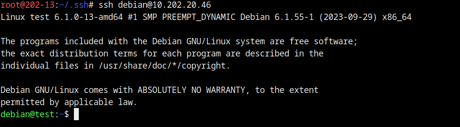

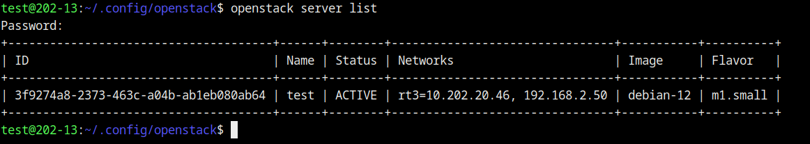

### Partie V - Déployer un wordpress avec ansible. Ansible doit créer un réseau, un sous réseau, un routeur. Puis une VM avec une floating IP, attendre qu'elle soit up puis se connecter dessus pour installer un wordpress.
[Lien vers mon script](scripts/openstack.yml)

**Execution du script:**
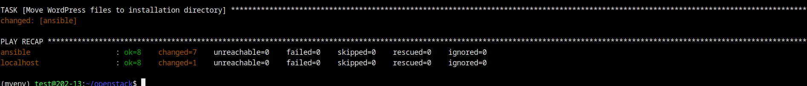

**_Après l'exécution du script j’ai eu ça comme résultats: Instance créé:_**

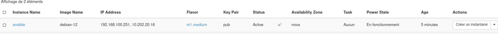

**- Topologie reseau:**
Là, on peut constater que le routeur ansible est bien attaché au réseau ansible déployé par le script:

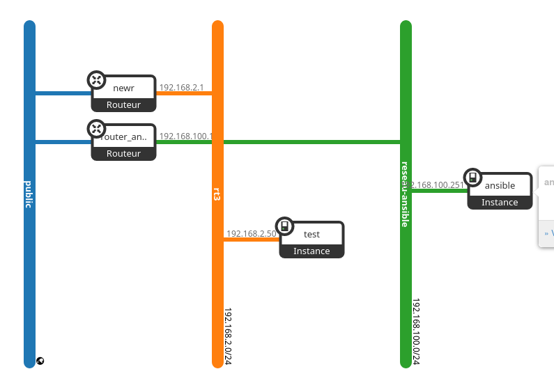

**- SSH:**
À partir d'adresse IP flottante donnés par le réseau j’ai pu me connecter en ssh apartir de ma machine physique:


**- Curl:**
À Partir de la machine en ssh j’ai testé la commande curl:
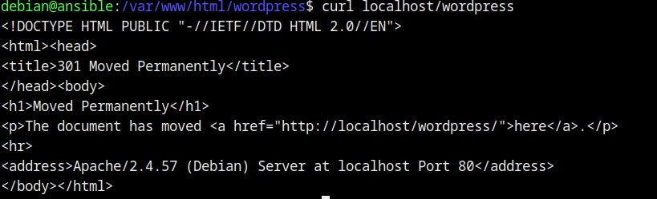

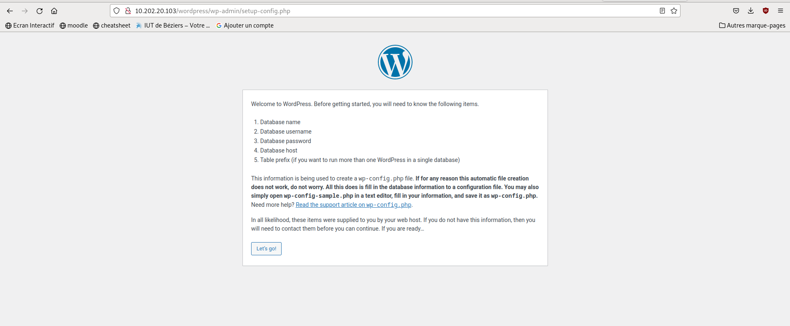

### Partie VI - En utilisant Terraform

[Lien vers mon script](scripts/ter.tf)

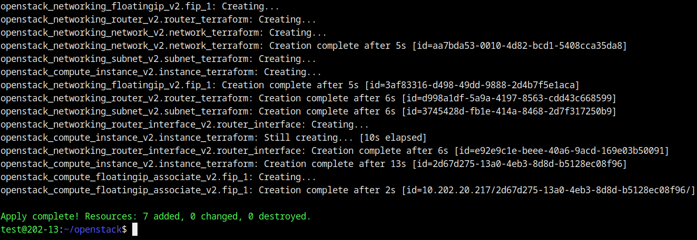

**_Aprés l'éxecution du script, voici le résultat:_**

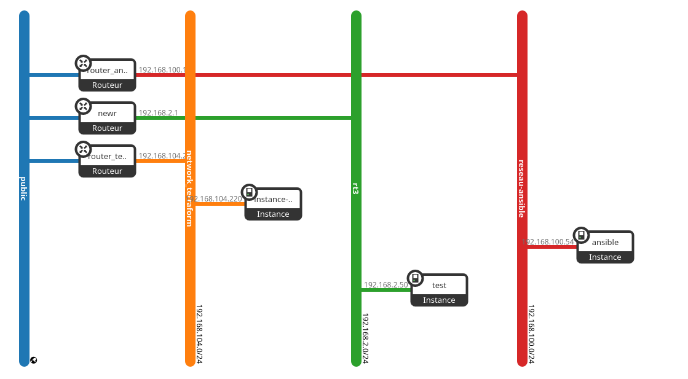


