# OpenStack

## Solutions Cloud utilisant OpenStack, Ansible, Terraform

### Partie I

- Pour donner les droits au fichier avant de commencer

```cmd
sudo chown test: clouds.yaml
```
1 - Création / Ajout d'une clef ssh dans votre projet

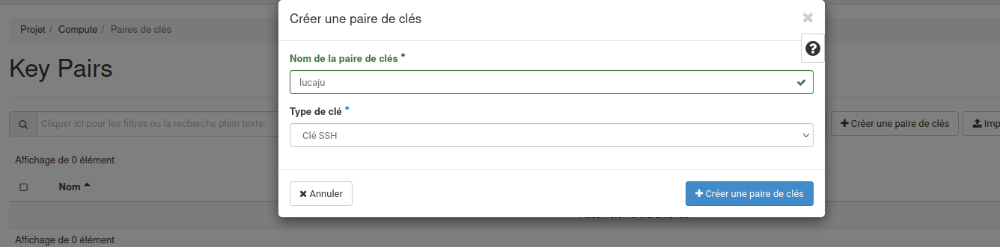

_**Pour créer une clé je suis allé dans “Paire de clés” et j’ai choisi un type de clé ssh.**_


**2 - Création Instance, type m1.medium, Image au choix mais sur un volume, security group SSH et Default
Ajout d'une Floating IP (réseau public2) et on se logge en SSH**

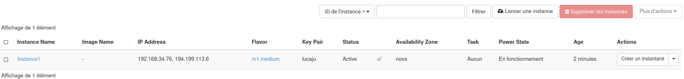

**Groupes de sécurité:**

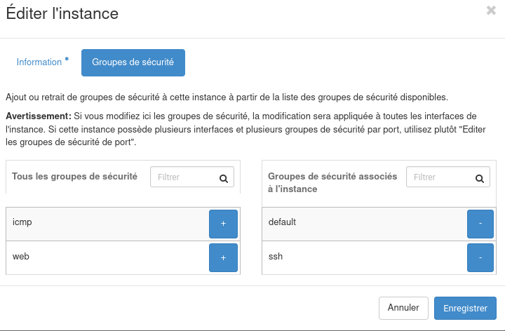

**Floating IP:**

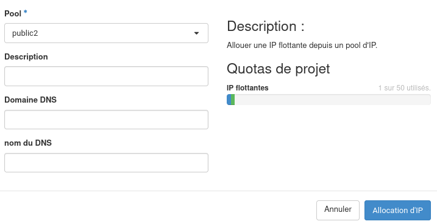

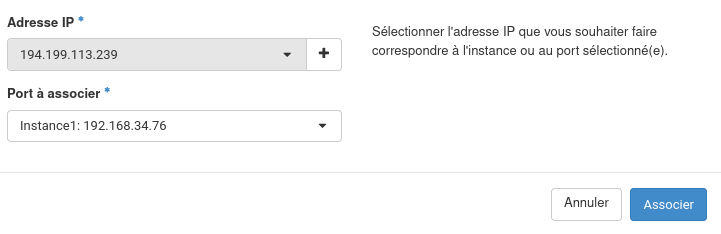


_**Test de connexion via SSH sur l'adresse public de l'instance crée:**_

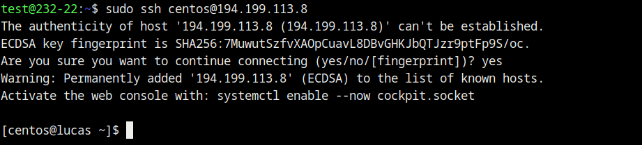

Sur ma machine physique j’ai reussi a me connecter grâce à une clé publique que j’ai généré avec la commande _**ssh-keygen**_. Après la génération de clé publique j’ai importé le fichier lors de la création de mon instance. Ensuite j’ai attaché mon instance à une adresse publique et j’ai réussi à me connecter en ssh.

### Partie II - En utilisant CLI

#### 1. IMPORTANT -> en WebUI créé un "credential applicatif" avec les droits "member" puis télécharger le fichier clouds.yaml. Mettre ce fichier dans le dossier ~/.config/openstack/

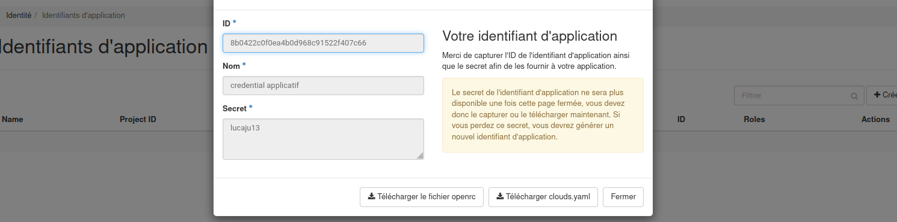

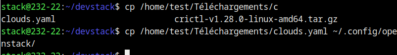

2. Installer la CLI OpenStack sur votre machine

https://docs.openstack.org/newton/user-guide/common/cli-install-openstack-command-line-clients.html


3. Exo1 en CLI
- Génération d’une clé:

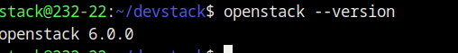

**Création d’une instance:**
openstack server create --flavor m1.medium --image CentOS-Stream-9-20220914 --key-name
nouvelle_cle --security-group ssh --security-group default instance_2

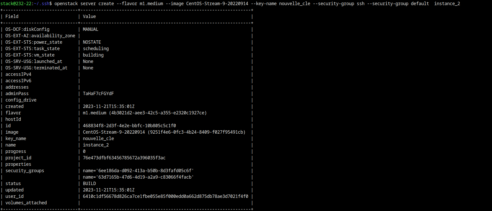

**Verification:**
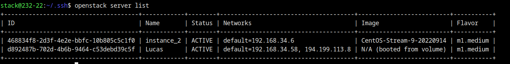

**Ajout d'une Floating IP (réseau public2) :**
openstack floating ip create public2

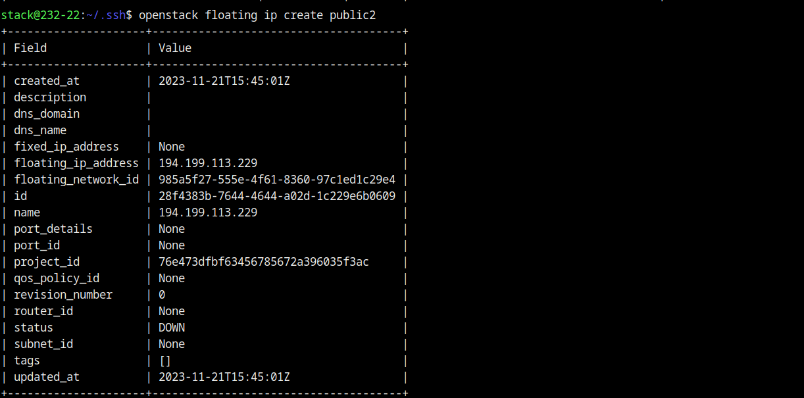

Commande pour ajouter ip: 

```cmd
openstack server add floating ip instance_2 194.199.113.229
```
Check si @ip était prise:
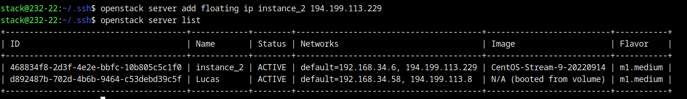


