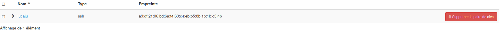

# OpenStack

## Solutions Cloud utilisant OpenStack, Ansible, Terraform

### Partie I

- Pour donner les droits au fichier avant de commencer

```cmd
sudo chown test: clouds.yaml
```
1 - Création / Ajout d'une clef ssh dans votre projet


Pour créer une clé je suis allé dans “Paire de clés” et j’ai choisi un type de clé ssh.



2 - Création Instance, type m1.medium, Image au choix mais sur un volume, security group SSH et Default
Ajout d'une Floating IP (réseau public2) et on se logge en SSH


*Groupes de sécurité:*


*Floating IP:*


